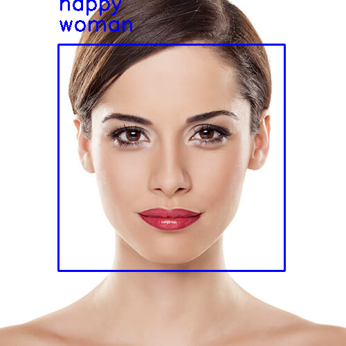

# Face classification and detection.
Real-time face detection and emotion/gender classification using fer2013/IMDB datasets with a keras CNN model and openCV.
* IMDB gender classification test accuracy: 96%.
* fer2013 emotion classification test accuracy: 66%.

For more information please consult the [publication](https://github.com/oarriaga/face_classification/blob/master/report.pdf)

# Emotion/gender examples:

### Make inference on single images:
> python3 image_emotion_gender_demo.py <image_path>

>if you wanna listen to music and show letters, make files named [happy,sad,natural,fear,surprise,disgust] in emotion_result

> python3 image_emotion_gender_demo.py ../images/test_image.jpg

### To train previous/new models for emotion classification:

* Download the fer2013.tar.gz file from [here](https://www.kaggle.com/c/challenges-in-representation-learning-facial-expression-recognition-challenge/data)

* Move the downloaded file to the datasets directory inside this repository.

* Untar the file:
> tar -xzf fer2013.tar

* Run the train_emotion_classification.py file
> python3 train_emotion_classifier.py

### To train previous/new models for gender classification:

* Download the imdb_crop.tar file from [here](https://data.vision.ee.ethz.ch/cvl/rrothe/imdb-wiki/) (It's the 7GB button with the tittle Download faces only).

* Move the downloaded file to the datasets directory inside this repository.

* Untar the file:
> tar -xfv imdb_crop.tar

* Run the train_gender_classification.py file
> python3 train_gender_classifier.py

